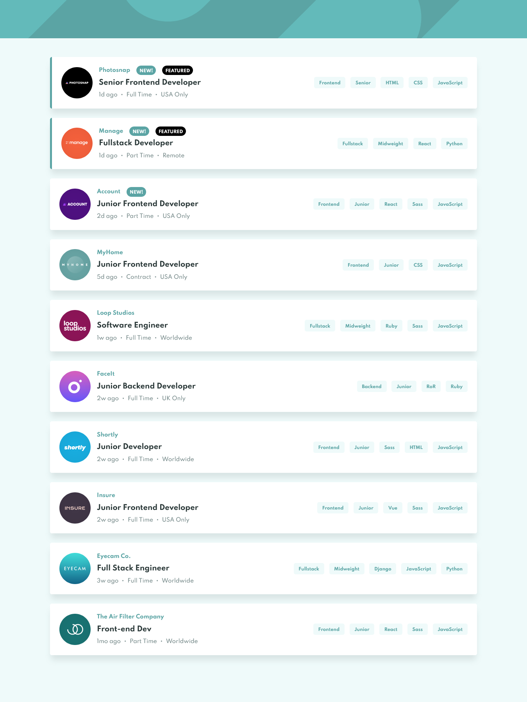

# Frontend Mentor - Job listings with filtering solution

This is a solution to the [Job listings with filtering challenge on Frontend Mentor](https://www.frontendmentor.io/challenges/job-listings-with-filtering-ivstIPCt). Frontend Mentor challenges help you improve your coding skills by building realistic projects.

## Table of contents

- [Overview](#overview)
  - [The challenge](#the-challenge)
  - [Screenshot](#screenshot)
  - [Links](#links)
- [My process](#my-process)
  - [Built with](#built-with)
- [Author](#author)

## Overview

### The challenge

Users should be able to:

- View the optimal layout for the site depending on their device's screen size
- See hover states for all interactive elements on the page
- Filter job listings based on the categories

### Screenshot

### Links

- Solution URL: [Add solution URL here](https://www.frontendmentor.io/solutions/vue-3-MYLy8rpmn)
- Live Site URL: [Add live site URL here](https://dvlapo-job-listings.netlify.app/)

## My process

### Built with

- [Vue 3](https://v3.vuejs.org/)

## Author

- Website - [Dolapo Agboola](https://dvlapo.netlify.app/)
- Frontend Mentor - [@dvlapo](https://www.frontendmentor.io/profile/dvlapo)
- Twitter - [@dvlapo](https://www.twitter.com/dvlapo)
